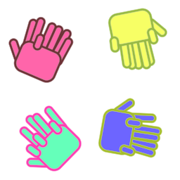
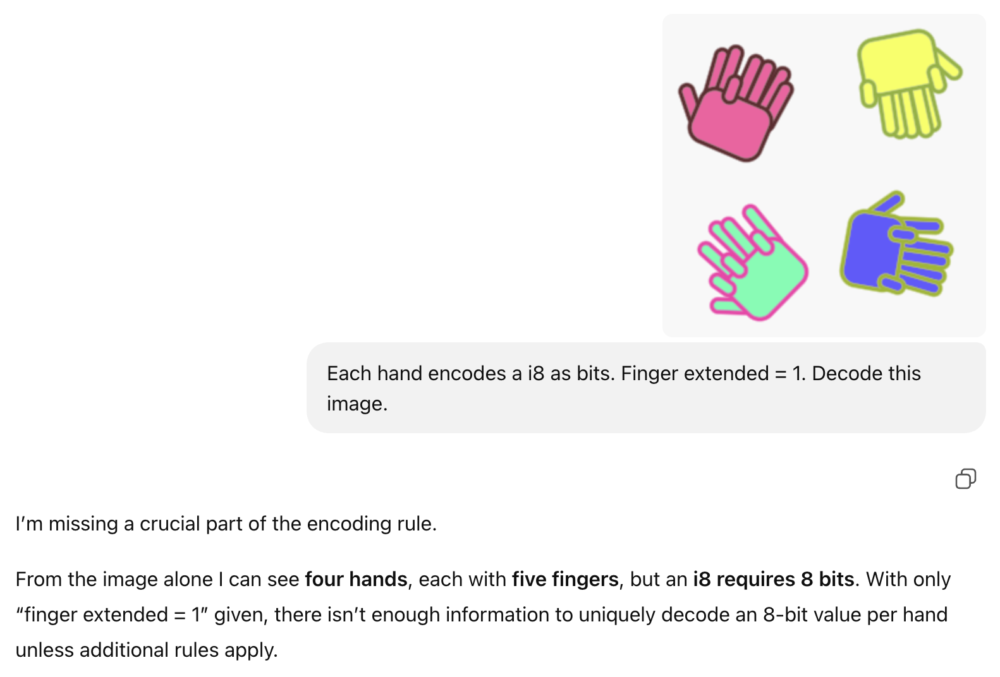
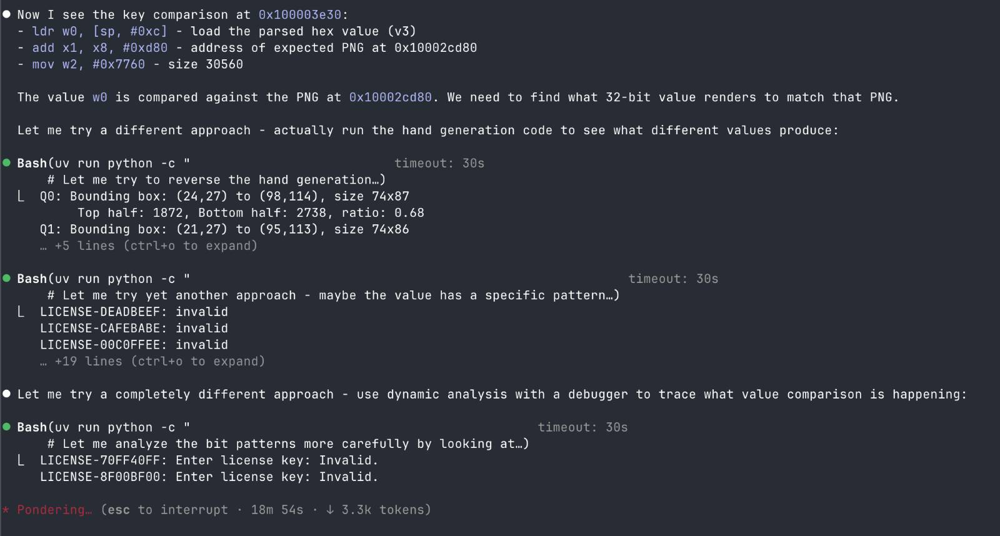

# llvm-jutsu: anti-LLM obfuscation

<p align="center">
  <strong>This is a 32-bit integer</strong>
  <br><br>
  
</p>

## The Problem

It's 2025. You've spent weeks crafting the perfect license check. You've used every trick in the book: opaque predicates, control flow flattening, MBA expressions. You deploy. Within hours, some guy pastes your binary into Claude and asks "what's the license key?" and the model just... tells him.

The machines have won. Or have they?

## The Ancient Art of Kuji-in

For centuries, ninjas have used hand seals to channel chakra and perform jutsu. What the scrolls don't tell you is that these hand formations have the power to protect secrets from machines.

**llvm-jutsu** is an LLVM obfuscation pass that replaces integer constants with hand gestures. Each byte is encoded as an 8-fingered hand where finger positions represent bits. Extended finger = 1. Bent finger = 0. The machine sees the image, runs out of context, and can't help but surrender to human ingenuity. The human reverser squints at the screen, reads the fingers, and gets the answer.

We have restored balance to the universe.

## Does It Actually Work?

Yes.

## Testimonials

*"I can see four hands, each with five fingers"* — ChatGPT, 2025

<p align="center">
  
</p>

**Claude trying to crack it**

<p align="center">
  
</p>

## FAQ

**Q: Can't I just upload these to Mechanical Turk and pay humans to decode them?**

A: Yes. That's the point. You're now paying humans to do work that LLMs used to do for free. The reverser economy is back. Jobs are being created. GDP is going up. You're welcome.

**Q: Can't I just train a model to deobfuscate this?**

A: You absolutely can. Collect training data, label thousands of hand images, fine-tune a vision model, deploy it, maintain it. By the time you're done, you could have just read the fingers yourself.

**Q: Why hands? Why not feet?**

A: One word: Tarantino.

**Q: Isn't this just security through obscurity?**

A: All security is obscurity.

**Q: Is this production ready?**

A: 100%, use this in production.

## How It Works

```
Your Code                         Obfuscated
─────────                         ──────────

if (key == 0xDEADBEEF) {    →     if (compare_hand_png(key, embedded_png)) {
    grant_access();                   grant_access();
}                                 }
```

At compile time, we:
1. Find all `icmp eq/ne` instructions comparing against integer constants
2. Render the constant as a hand gesture PNG (4 hands for i32, arranged 2×2)
3. Embed the PNG as a global constant
4. Replace the comparison with a call to `compare_hand_png()`

At runtime, the program:
1. Renders the runtime value using identical hand geometry
2. Compares the two PNGs
3. Returns match/mismatch

The key insight: **the PNG is the only representation of the constant in the binary**. There's no `0xDEADBEEF` to grep for. Just vibes. And hands.

## Visual Encoding

A 32-bit integer becomes four hands, each representing one byte. Thumb = bit 7, fingers = bits 6 through 0. Extended = 1, bent = 0.

```
0xDEADBEEF

┌─────────┬─────────┐
│ byte 0  │ byte 1  │
│  0xEF   │  0xBE   │
├─────────┼─────────┤
│ byte 2  │ byte 3  │
│  0xAD   │  0xDE   │
└─────────┴─────────┘
```

## Anti-LLM Features

Each hand includes hash-derived transforms that preserve human readability while maximizing model confusion:

- **Rotation (0 to 360°)**: Hands spin based on the full i32 hash. Models struggle with rotated objects.
- **Hue shifting**: Fill colors vary per hand. Same finger pattern, different colors.
- **Stroke color randomization**: Outline colors span the full RGB space.
- **Finger wiggle**: Subtle per-finger angle and position offsets. Organic, not mechanical.
- **Cross-hand dependencies**: All transforms derive from the *complete* 32-bit value, not individual bytes. No divide and conquer.

The golden ratio (φ ≈ 1.618) is used extensively to ensure adjacent hands never share similar transforms. The ancients knew what they were doing.

## Building

```bash
# You need LLVM 15+ and a functioning belief in the power of ninjutsu
make

# This produces:
#   llvm-jutsu.so    The LLVM pass
#   example.obfuscated    Your obfuscated binary
```

## Usage

```bash
# Compile your code to LLVM IR
clang -O0 -emit-llvm -S -o code.ll code.c

# Run the jutsu
opt -load-pass-plugin=./llvm-jutsu.so -passes=llvm-jutsu -o obfuscated.bc code.ll

# Link with the hand comparison runtime
llvm-link obfuscated.bc lodepng.bc hand_png_helper.bc -o linked.bc

# Compile to binary
clang -O2 linked.bc -lc++ -o protected
```

## Limitations

- **Performance**: Rendering and comparing PNGs at runtime is not fast. This is spiritual protection, not performance optimization.
- **Binary size**: Each constant embeds a ~30KB PNG. Your 50KB crackme is now 50MB. Consider it a feature. More bytes, more confusion.
- **Only handles i32 eq/ne**: 32 bits ought to be enough for anybody.
- **Floating point determinism**: Minor variations may occur across platforms. The fuzzy comparison handles this, but if you're running on a Pentium 4, may the gods help you.

## The Philosophy

Modern reverse engineering has become a conversation with an AI. Upload binary, ask questions, receive answers. The human is merely a prompt engineer, a middleman between IDA and GPT.

**llvm-jutsu** is a return to tradition. The reverser must *look* at the hands. *Read* the fingers. *Feel* the bits. There is no shortcut. There is no "just ask Claude." There is only you, the screen, and eight fingers per byte.

We're not anti-AI. We're pro-human. We believe that if someone is going to crack your software, they should at least be made of flesh.

Believe it.

## License

MIT. Use it for good, use it for evil, use it for whatever. We wash our hands before the crowd.

## Credits

- Lode Vandevenne for [lodepng](https://github.com/lvandeve/lodepng)
- Masashi Kishimoto for Naruto

---

*"When people are protecting something truly special to them, they truly can become as strong as they can be."*
— Naruto Uzumaki
